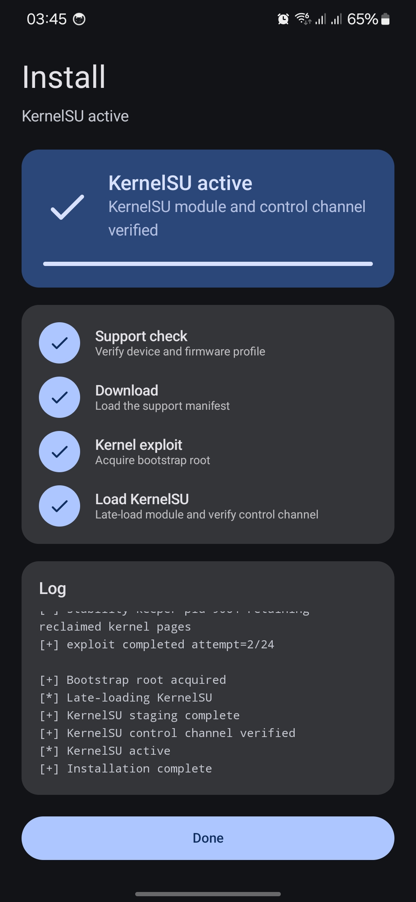
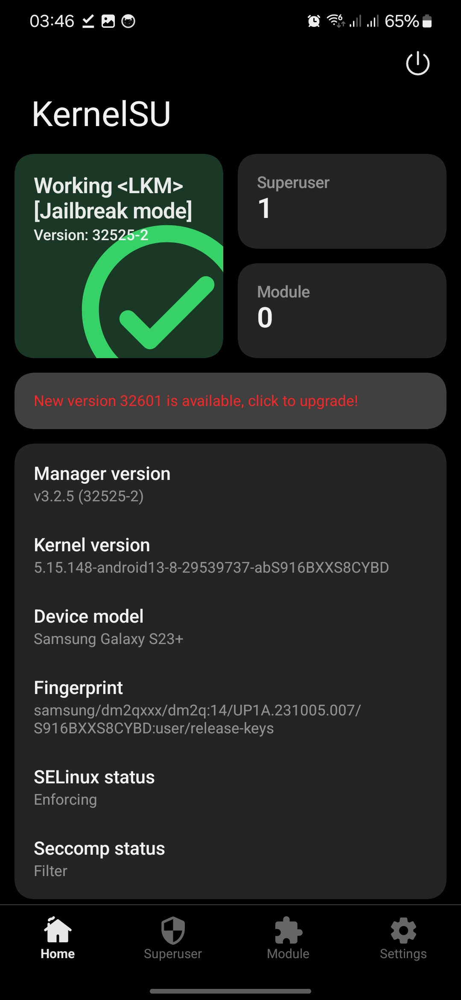

# SM-S916B / S916BXXS8CYBD

Galaxy S23+ (international, `dm2q`) on firmware `S916BXXS8CYBD`
(`UP1A.231005.007.S916BXXS8CYBD`), kernel
`5.15.148-android13-8-29539737-abS916BXXS8CYBD`.

Status: **hardware-verified end-to-end through the Root My Galaxy app**
(Shizuku execution mode), including KernelSU late-load, a working control
channel, and app-facing `su` under SELinux enforcing.

## What this profile is

- Open-source engine (this repository) with the tracefs KASLR discovery,
  controlled 32-object `mm_struct` group reclaim, shaped order-3 SKB reclaim,
  MCAST stale-waiter write, fake ashmem fops, configfs arbitrary read/write,
  pipe physical read/write, and a root usermode helper.
- Distinct kernel image with its own offset set: every offset was re-derived
  from this firmware and the P0 table was regenerated from this Image, rather
  than assumed.
- Exact-firmware bound. Do not select it for another S23+ build, model, or
  kernel release.

## Firmware identity and acquisition

Read on-device over ADB (and independently confirmed from the AP archive):

```text
model: SM-S916B
device: dm2q (product dm2qxxx)
display build: UP1A.231005.007.S916BXXS8CYBD
fingerprint: samsung/dm2qxxx/dm2q:14/UP1A.231005.007/S916BXXS8CYBD:user/release-keys
SDK: 34 (Android 14)
kernel release: 5.15.148-android13-8-29539737-abS916BXXS8CYBD
kernel build: #1 SMP PREEMPT Tue Feb 25 09:52:35 UTC 2025
```

## Kernel extraction and hashes

AP tar → `boot.img` → boot image header v4, `kernel_size` u32 at 0x08, kernel
blob at 0x1000:

```text
boot.img size: 100663296
boot.img SHA-256: 61671a66e7178ac67de367a9b46c4f301f762da2341285da9c30bf78d229d659
kernel size: 45017600
ARM64 Image text_offset: 0x0
```

## Symbol and BTF recovery

`vmlinux-to-elf` recovered the symbolized ELF at image base
`0xffffffc008000000` (`vmlinux.elf` SHA-256
`0fe1d7ebbaf6fb4977503b7a03a2726ac5f5a2a6c9f84dc99df7988dba7be3c1`). Offsets
were derived from this kernel's own symbol table. The raw BTF blob (embedded
in the kernel Image) can be extracted offline with the procedure in
[`PORTING.md`](PORTING.md) and dumped with
`bpftool btf dump file vmlinux.btf format raw`; the on-device
`/sys/kernel/btf/vmlinux` path is not required.

| Macro/use | Symbol or derivation | Offset |
| --- | --- | ---: |
| `INIT_TASK_OFF` | `init_task` | `0x02a48740` |
| `PREPARE_KERNEL_CRED_OFF` | `prepare_kernel_cred` | `0x0011d168` |
| `COMMIT_CREDS_OFF` | `commit_creds` | `0x0011eea4` |
| `OVERRIDE_CREDS_OFF` | `override_creds` | `0x0011df7c` |
| `ROOT_TASK_GROUP_OFF` | `root_task_group` | `0x02af7ac0` |
| `SELINUX_ENFORCING_OFF` | `selinux_state.enforcing` | `0x02bcc390` |
| `KMALLOC_CACHES_OFF` | `kmalloc_caches` | `0x01f1d980` |
| `ANON_PIPE_BUF_OPS_OFF` | `anon_pipe_buf_ops` | `0x01d49d60` |
| `SYSTEM_UNBOUND_WQ_OFF` | `system_unbound_wq` | `0x028de470` |
| `CALL_USERMODEHELPER_EXEC_WORK_OFF` | `call_usermodehelper_exec_work` | `0x00103590` |
| `ASHMEM_FOPS_OFF` | `ashmem_fops` | `0x01ec7100` |
| `ASHMEM_MISC_FOPS_OFF` | `ashmem_misc + offsetof(miscdevice, fops)` | `0x02a408c8` |
| `ASHMEM_IOCTL_OFF` | `ashmem_ioctl` | `0x0105b068` |
| `ASHMEM_COMPAT_IOCTL_OFF` | `compat_ashmem_ioctl` | `0x0105b6c4` |
| `ASHMEM_MMAP_OFF` | `ashmem_mmap` | `0x0105b71c` |
| `ASHMEM_OPEN_OFF` | `ashmem_open` | `0x0105b9fc` |
| `ASHMEM_RELEASE_OFF` | `ashmem_release` | `0x0105ba94` |
| `ASHMEM_SHOW_FDINFO_OFF` | `ashmem_show_fdinfo` | `0x0105bbb0` |
| `CONFIGFS_READ_ITER_OFF` | `configfs_read_iter` | `0x005d0528` |
| `CONFIGFS_BIN_WRITE_ITER_OFF` | `configfs_bin_write_iter` | `0x005d0f50` |
| `COPY_SPLICE_READ_OFF` | `generic_file_splice_read` | `0x00521824` |
| `NOOP_LLSEEK_OFF` | `noop_llseek` | `0x004b4660` |
| `SLIDE_NFULNL_LOGGER_NAME_OFF` | `"nfnetlink_log"` string | `0x01c3e3c0` |
| `SLIDE_NFULNL_LOGGER_OBJECT_OFF` | `nfulnl_logger` object | `0x028e1e18` |
| `SLIDE_RANDOM_TABLE_BOOT_ID_DATA_PTR_OFF` | `boot_id` `.data` pointer slot | `0x029fe728` |
| `SLIDE_SYSCTL_BOOTID_OFF` | `sysctl_bootid` storage | `0x02c6d429` |
| `KIMAGE_TEXT_BASE` | recovered ELF base | `0xffffffc008000000` |
| `P0_PHYS_OFFSET` / `P0_KERNEL_PHYS_LOAD` | Qualcomm ARM64 convention | `0x80000000` / `0x80080000` |

Layout values (`mm_struct` 0x400, compact `rt_mutex_waiter` 0x58, KABI
`file_operations`, fake-task pi block, `worker_pool` 0x20/0x34, `struct page`
0x40, `selinux_state.enforcing` at +0) are the values this profile was
validated with; the BTF from this Image can be used to confirm them.

### `.data` positions

These `.data` positions were read from this Image's own symbol table rather
than carried over from another build:

```text
KMALLOC_CACHES_OFF           0x01f1d980
ANON_PIPE_BUF_OPS_OFF        0x01d49d60
ASHMEM_FOPS_OFF              0x01ec7100
SLIDE_NFULNL_LOGGER_NAME_OFF 0x01c3e3c0
```

### Tracefs slide anchors

`SLIDE_TRACEFS_EVENT_ID` is **108** (read on-device from
`/sys/kernel/tracing/events/sched/sched_blocked_reason/id`).
`SLIDE_TRACEFS_WORKER_CALLER_OFF` is `0x0010c9c4` (observed live as
`worker_thread+0x78`). `SLIDE_TRACEFS_VFORK_CALLER_OFF` is `0x000c87a0`
(recovered from the ELF; the vfork caller was not separately observed in the
captured trace, and the leak is anchored by the worker caller).

### P0 fingerprint

`src/targets/dm2q-S916BXXS8CYBD/p0_fingerprint.h` was generated from the
exact raw Image at probe offset `0x1f0000` (32 slide rows, 256 source qwords).
`P0_KERNEL_PHYS_LOAD 0x80080000` is adopted from the same-SoC S23 family and is
fail-closed (the physical oracle aborts unless the probed page matches).

## KernelSU

Built from KernelSU `v3.2.5` (commit `b0bc817`) with
`kernelsu/patches/KernelSU-v3.2.5-samsung-kdp-rkp-defex.patch` plus the
`dm2q-fzg1` variant, out-of-tree against the exact device release, with
`CONFIG_KSU_SAMSUNG_NO_PATCH_TEXT=y` because Samsung RKP pins `sys_call_table`
read-only at EL2. The build resolves `sys_call_table` before the RKP
dispatcher early-return, so the Samsung sucompat kprobes register.

Audited against this firmware's `vmlinux.elf` with
`kernelsu/tools/audit_module_against_target.py --manual-relocation`:

```text
undefined symbols: 200
module version entries: 0
missing from target symbol table: 0
symbols resolved from kallsyms rather than target exports: 65
target CRC mismatches: 0

vermagic: 5.15.148-android13-8-29539737-abS916BXXS8CYBD SMP preempt mod_unload modversions aarch64
__versions size: 0
.symtab/.strtab: retained
```

Published artifacts:

```text
kernelsu/android13-5.15.148_kernelsu-dm2q-S916BXXS8CYBD-kdp.ko
  size: 356040
  SHA-256: 4ced75234a61807b62bbaafae30ba82fb6d054657a7434d4ce8033e748bf1664

kernelsu/ksud-dm2q-S916BXXS8CYBD-kdp
  size: 4920304
  SHA-256: 0e149b6be467cc2ce222057039e2ea977d1aec2e564b58369a0056ad19d35ac1
```

## App flow (Shizuku execution mode)

The tracefs route needs the shell domain, so Root My Galaxy is run in
**Shizuku mode** (the payload executes as `u:r:shell:s0`). The app resolves the
profile from the support feed, downloads the exploit and `ksud`, runs the
payload through Shizuku, then performs the guarded KernelSU late-load and
verifies the control channel.

## Device validation

Verified on a physical `SM-S916B` on the exact build, Root My Galaxy `0.2.65`,
KernelSU Manager `v3.2.5 (32525-2)`, SELinux enforcing.

```text
[+] exploit completed attempt=2/24
[+] Bootstrap root acquired
[+] KernelSU staging complete
[+] KernelSU control channel verified
[*] KernelSU active
[+] Installation complete
```

`/proc/modules` shows `kernelsu ... Live`, KernelSU Manager reports
`Working <LKM> [Jailbreak mode]` with the exact fingerprint
`samsung/dm2qxxx/dm2q:14/UP1A.231005.007/S916BXXS8CYBD:user/release-keys`
under SELinux `Enforcing`, and with `su_compat` enabled `/system/bin/su`
works, so apps (for example Termux) can use the standard `su` once the manager
grants them root.

Root and the module are volatile per boot; no boot image was modified and the
bootloader remains locked.

Screenshots from the validated device, courtesy of `@zandatsu07`:

| Root My Galaxy (install complete) | KernelSU Manager (working) |
| --- | --- |
|  |  |

## Reliability

Per-boot success is probabilistic, as with the other tracefs/MCAST Samsung
profiles. Run close to boot for the best odds; failed attempts can reboot the
phone. After the stack-writer stage a failed attempt leaves PI state behind and
the engine refuses further in-boot retries
(`stack writer ran; refusing retry on this boot`); reboot and run again.

## Thanks

Thanks to `@zandatsu07` for the static port, the P0 generation, the on-device
validation of this build, and the validation screenshots (see #331). Device
validated 2026-09-16.
