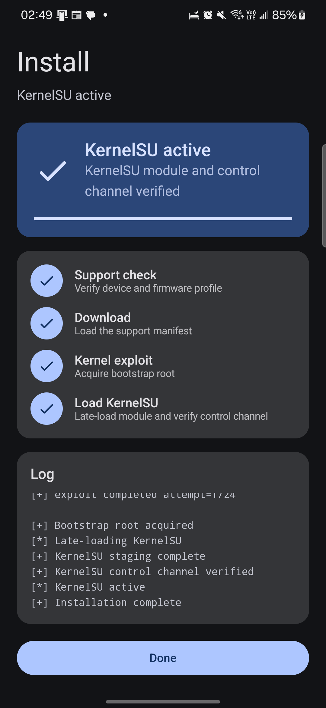
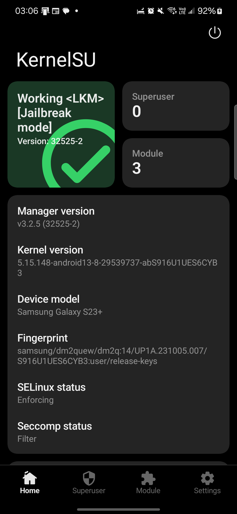

# SM-S916U1 / S916U1UES6CYB3

Galaxy S23+ (US unlocked, `dm2q`) on firmware `S916U1UES6CYB3`
(`UP1A.231005.007.S916U1UES6CYB3`, XAA), kernel
`5.15.148-android13-8-29539737-abS916U1UES6CYB3`.

Status: **hardware-verified end-to-end through the Root My Galaxy app**
(Shizuku execution mode), including KernelSU late-load and a working
KernelSU control channel under SELinux enforcing.

## What this profile is

- Open-source engine (this repository) with the tracefs KASLR discovery,
  controlled 32-object `mm_struct` group reclaim, shaped order-3 SKB reclaim,
  MCAST stale-waiter write, fake ashmem fops, configfs arbitrary read/write,
  pipe physical read/write, and a root usermode helper.
- Same engine family as the `dm1q-S911U1UES6DYI3` (US S23) port, but a
  distinct kernel (`5.15.148`, Samsung `android13-5.15`) with its own layout
  and `.data` positions; nothing was carried over without re-derivation.
- Exact-firmware bound. Do not select it for another S23+ build, model, or
  kernel release.

## Firmware identity and acquisition

Samsung FUS / SAMFW firmware for model `SM-S916U1`, region `XAA`:

```text
model: SM-S916U1
device: dm2q (product dm2quew)
display build: UP1A.231005.007.S916U1UES6CYB3
fingerprint: samsung/dm2quew/dm2q:14/UP1A.231005.007/S916U1UES6CYB3:user/release-keys
SDK: 34 (Android 14)
CSC: XAA
kernel release: 5.15.148-android13-8-29539737-abS916U1UES6CYB3
kernel build: #1 SMP PREEMPT Wed Feb 26 13:51:13 UTC 2025
```

Device-side ground truth was read over ADB before any exploit run.

## Kernel extraction and hashes

AP tar → `boot.img.lz4` (LZ4-frame) → boot image header v4,
`kernel_size` u32 at 0x08, kernel blob at 0x1000:

```text
boot.img size: 100663296
boot.img SHA-256: 2ccb04d86cdbaf37d36d3fb6de9bd9dede739c943acb5d408429cbd3d8bcf87e
kernel size: 45017600
kernel SHA-256: 316502d3fe1a8f80902f426d01e513936f0acdefef12c539b8a98c31d6f5e533
ARM64 Image text_offset: 0x0
```

## Symbol and BTF recovery

`vmlinux-to-elf` recovered the symbolized ELF at image base
`0xffffffc008000000` (121,159 symbols; `vmlinux.elf` SHA-256
`120130f573a2c94143147fcbba9c7a5b17856d250ec4199711af838645ab2995`). A
raw-BTF scan found one validated blob (`vmlinux.btf`); all exploit-relevant
layouts were derived from this kernel's own BTF and symbol table.

| Macro/use | Symbol or derivation | Offset |
| --- | --- | ---: |
| `INIT_TASK_OFF` | `init_task` | `0x02a48740` |
| `PREPARE_KERNEL_CRED_OFF` | `prepare_kernel_cred` | `0x0011d168` |
| `COMMIT_CREDS_OFF` | `commit_creds` | `0x0011eea4` |
| `OVERRIDE_CREDS_OFF` | `override_creds` | `0x0011df7c` |
| `ROOT_TASK_GROUP_OFF` | `root_task_group` | `0x02af7ac0` |
| `SELINUX_ENFORCING_OFF` | `selinux_state.enforcing` | `0x02bcc390` |
| `KMALLOC_CACHES_OFF` | `kmalloc_caches` | `0x01f1da80` |
| `ANON_PIPE_BUF_OPS_OFF` | `anon_pipe_buf_ops` | `0x01d49e60` |
| `SYSTEM_UNBOUND_WQ_OFF` | `system_unbound_wq` | `0x028de470` |
| `CALL_USERMODEHELPER_EXEC_WORK_OFF` | `call_usermodehelper_exec_work` | `0x00103590` |
| `ASHMEM_FOPS_OFF` | `ashmem_fops` | `0x01ec7200` |
| `ASHMEM_MISC_FOPS_OFF` | `ashmem_misc + offsetof(miscdevice, fops)` | `0x02a408c8` |
| `ASHMEM_IOCTL_OFF` | `ashmem_ioctl` | `0x0105b068` |
| `ASHMEM_COMPAT_IOCTL_OFF` | `compat_ashmem_ioctl` | `0x0105b6c4` |
| `ASHMEM_MMAP_OFF` | `ashmem_mmap` | `0x0105b71c` |
| `ASHMEM_OPEN_OFF` | `ashmem_open` | `0x0105b9fc` |
| `ASHMEM_RELEASE_OFF` | `ashmem_release` | `0x0105ba94` |
| `ASHMEM_SHOW_FDINFO_OFF` | `ashmem_show_fdinfo` | `0x0105bbb0` |
| `CONFIGFS_READ_ITER_OFF` | `configfs_read_iter` | `0x005d0528` |
| `CONFIGFS_BIN_WRITE_ITER_OFF` | `configfs_bin_write_iter` | `0x005d0f50` |
| `COPY_SPLICE_READ_OFF` | `generic_file_splice_read` | `0x00521824` |
| `NOOP_LLSEEK_OFF` | `noop_llseek` | `0x004b4660` |
| `SLIDE_NFULNL_LOGGER_NAME_OFF` | `"nfnetlink_log"` string | `0x01c3e4ef` |
| `SLIDE_NFULNL_LOGGER_OBJECT_OFF` | `nfulnl_logger` object | `0x028e1e18` |
| `SLIDE_RANDOM_TABLE_BOOT_ID_DATA_PTR_OFF` | `boot_id` `.data` pointer slot | `0x029fe728` |
| `SLIDE_SYSCTL_BOOTID_OFF` | `sysctl_bootid` storage | `0x02c6d429` |
| `KIMAGE_TEXT_BASE` | recovered ELF base | `0xffffffc008000000` |
| `P0_PHYS_OFFSET` / `P0_KERNEL_PHYS_LOAD` | Qualcomm ARM64 convention | `0x80000000` / `0x80080000` |

BTF-derived layout values used: `mm_struct` 0x400, compact `rt_mutex_waiter`
0x58 (`pi_tree_entry` 0x18, `task` 0x30, `lock` 0x38, `wake_state`/`prio`
0x40/0x44), KABI `file_operations` (ioctl 0x50, mmap 0x60, open 0x70,
release 0x80, splice_read 0xc8, show_fdinfo 0xe0), fake-task pi block
(`pi_lock` 0x884, `pi_waiters` 0x898, `pi_top_task` 0x8a8,
`pi_blocked_on` 0x8b0), `worker_pool.worklist` 0x20, `nr_idle` 0x34,
`struct page` 0x40, and `selinux_state.enforcing` at +0.

### Tracefs slide anchors

`SLIDE_TRACEFS_EVENT_ID` is **108**, read authoritatively on-device from
`/sys/kernel/tracing/events/sched/sched_blocked_reason/id` and confirmed by
the runtime trace.

`SLIDE_TRACEFS_WORKER_CALLER_OFF` = `0x0010c9c4` (in `worker_thread`, the
instruction after the blocking `bl schedule`) and
`SLIDE_TRACEFS_VFORK_CALLER_OFF` = `0x000c87a0` (in `wait_for_vfork_done`,
the return of `bl wait_for_common`). Both were observed live as
`worker_thread+0x78` / `wait_for_vfork_done+0x44` after subtracting the
recovered slide.

### Physical P0 and the fingerprint table

The Qualcomm BL archive for this firmware carries no analyzable kernel
load-address literal, so `P0_KERNEL_PHYS_LOAD = 0x80080000` is adopted from
the same-SoC (SM8550) S23 family and is **fail-closed**: the payload
fingerprint-matches the probed page against `p0_fingerprint.h` before any
write, and aborts on mismatch.

`src/targets/dm2q-S916U1UES6CYB3/p0_fingerprint.h` was generated from the
exact raw `Image` at probe offset `0x1f0000` (32 slide rows, 256 source
qwords, readback-verified).

## KernelSU

Built from KernelSU `v3.2.5` (commit `b0bc817`) with
`kernelsu/patches/KernelSU-v3.2.5-samsung-kdp-rkp-defex.patch` plus the
`dm2q-fzg1` variant (Samsung `android13-5.15` still names the ucounts type
`enum ucount_type`), out-of-tree against the exact device IKCONFIG from
`/proc/config.gz`, with `CONFIG_KSU_SAMSUNG_NO_PATCH_TEXT=y`, because Samsung
RKP pins `sys_call_table` read-only at EL2, so live text patching is disabled
and KernelSU uses its kretprobe/kprobe fallback hooks.

Audited against the recovered exact `vmlinux.elf` with
`kernelsu/tools/audit_module_against_target.py --manual-relocation`:

```text
undefined symbols: 200
module version entries: 0
missing from target symbol table: 0
symbols resolved from kallsyms rather than target exports: 65
target CRC mismatches: 0

vermagic: 5.15.148-android13-8-29539737-abS916U1UES6CYB3 SMP preempt mod_unload modversions aarch64
__versions size: 0
.symtab/.strtab: retained
```

The non-exported imports require the kallsyms-aware `ksud` manual loader;
plain `insmod` is not supported.

The shipped pair resolves `sys_call_table` with
`ksu_resolve_symbol_for_functable_hook()` **before** the RKP dispatcher
early-return, so the Samsung sucompat kprobes register
(`Samsung sucompat kprobes registered`) and app-facing `su` works:
`/system/bin/su -c id` returns `uid=0` in `u:r:ksu:s0`, `/system/bin/su`
resolves through the stat hook, and `ksud feature list` reports
`su_compat [ENABLED]`. A build that returns from `ksu_syscall_hook_init()`
before resolving the table leaves `ksu_syscall_table` NULL, and `su_compat`
then reports `NOT_SUPPORTED`; this profile ships the resolved ordering.

Published KernelSU artifacts:

```text
kernelsu/android13-5.15.148_kernelsu-dm2q-S916U1UES6CYB3-kdp.ko
  size: 356040
  SHA-256: 3f8bfcfc0e382c161c34f9b1578a3874d574c5dd22abf172f5e7ba556a112ab7

kernelsu/ksud-dm2q-S916U1UES6CYB3-kdp
  size: 4920304
  SHA-256: 127e9b4ad5bcaa0ef69c8d1b0b7c107464510da55821846eff0823be683ae179
```

## App flow (Shizuku execution mode)

This profile's KASLR route uses tracefs, which is available to the ADB-shell
domain but not to a normal app domain (the app's own probe reports
`tracefs_control=denied errno=13` under `u:r:untrusted_app:s0`). The app is
therefore run in **Shizuku mode**, where the payload executes as the shell
user (`u:r:shell:s0`) and the tracefs route is reachable.

1. Start Shizuku (via its ADB starter, or wireless-debugging pairing).
2. Open Root My Galaxy, enable **Use Shizuku**, and grant the permission.
3. Run the install for
   `Galaxy S23+ (US) SM-S916U1 | Kernel 5.15.148 (S916U1UES6CYB3)`.

The app resolves the profile from the support feed, stages the helper, the
payload, and `ksud` into `/data/local/tmp`, runs the payload through Shizuku,
and then performs the guarded KernelSU `--late-load` and verifies the control
channel.

## Device validation

Verified on a physical `SM-S916U1` running the exact build above, Root My
Galaxy `0.2.65 (13)`, KernelSU Manager `v3.2.5 (32525-2)`, SELinux enforcing.

Successful run (fresh boot, Shizuku mode, first exploit attempt):

```text
[+] exploit completed attempt=1/24
[+] pipe physrw pid=21014 done=1 root=1 kaslr=1 read_ok=1 write_ok=1 rw64=1/1 uid=2000->0
[+] Bootstrap root acquired
[+] KernelSU staging complete
[+] KernelSU control channel verified
[*] KernelSU active
[+] Installation complete
```

Post-run state:

```text
$ cat /proc/modules | grep kernelsu
kernelsu 208896 0 - Live ... (OE)
```

KernelSU Manager reports `Working <LKM> [Jailbreak mode]`, version
`32525-2`, with the exact fingerprint
`samsung/dm2quew/dm2q:14/UP1A.231005.007/S916U1UES6CYB3:user/release-keys`
and SELinux `Enforcing`. With `su_compat` enabled, `/system/bin/su -c id`
returns `uid=0(root)` in `u:r:ksu:s0`, so apps (for example Termux) can use
the standard `su` once the manager grants them root.

Device evidence:

| Root My Galaxy | KernelSU Manager |
| --- | --- |
|  |  |

Root and the module are volatile per boot. No boot image was modified and the
bootloader remains locked. After a reboot the payload must be run again.

## Reliability

Per-boot success is probabilistic, as with the other tracefs/MCAST Samsung
profiles. Run close to boot for the best odds. The supervisor retries before
the stack-writer stage; after the stack-writer stage a failed attempt leaves
PI state behind and the engine refuses further in-boot retries
(`stack writer ran; refusing retry on this boot`); reboot and run again.
Both validation runs here completed on the first attempt.

## Authorship

Port and on-device validation performed on the target `SM-S916U1`. Device
verified 2026-09-11.

## Header review notes

`target.h` is derived from the `dm1q-S911U1UES6DYI3` profile shape, so two
labels were corrected for this target: `BUILD_VARIANT_LABEL` and
`P0_FINGERPRINT_HEADER` now name `dm2q-S916U1UES6CYB3`, and the Makefile
selects `-DSLIDE_STACK_WRITER=1` for this target.
